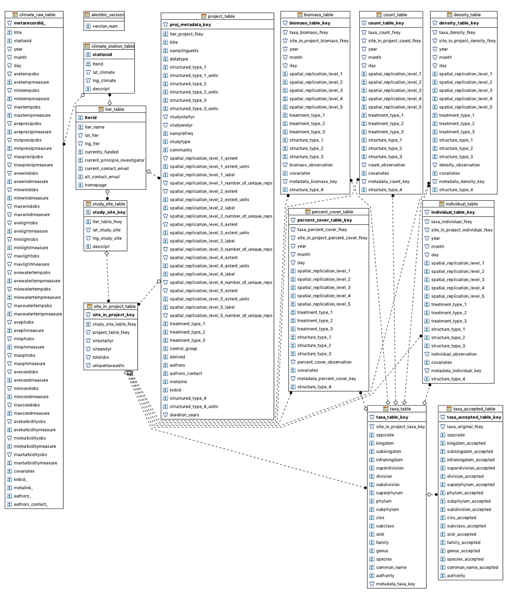
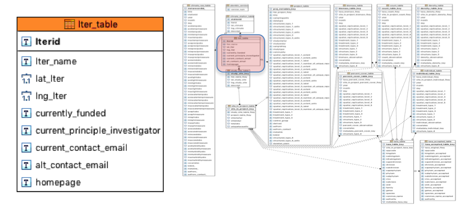
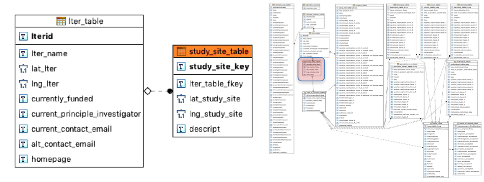
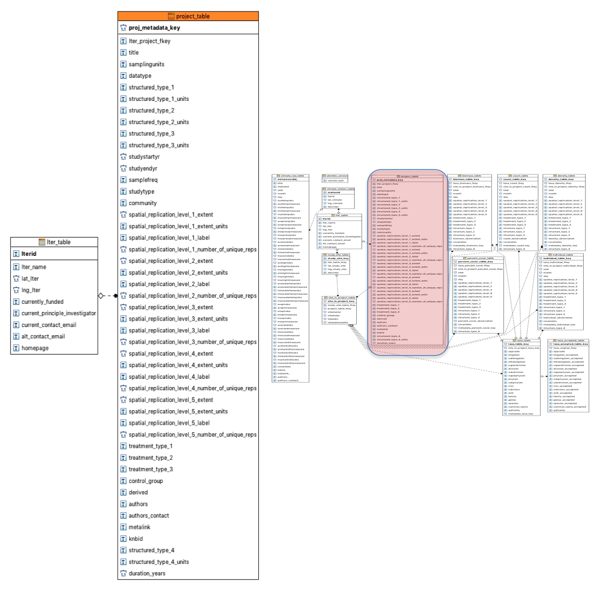
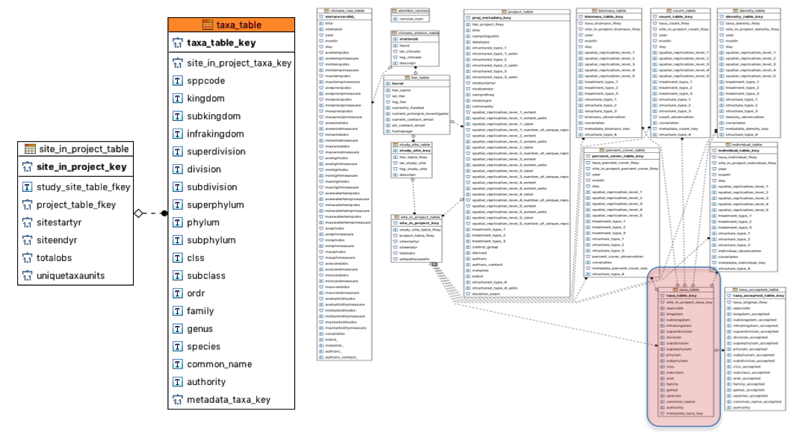
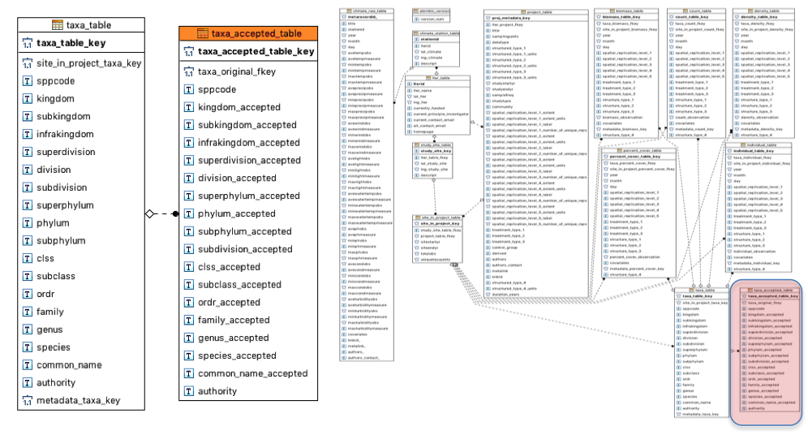
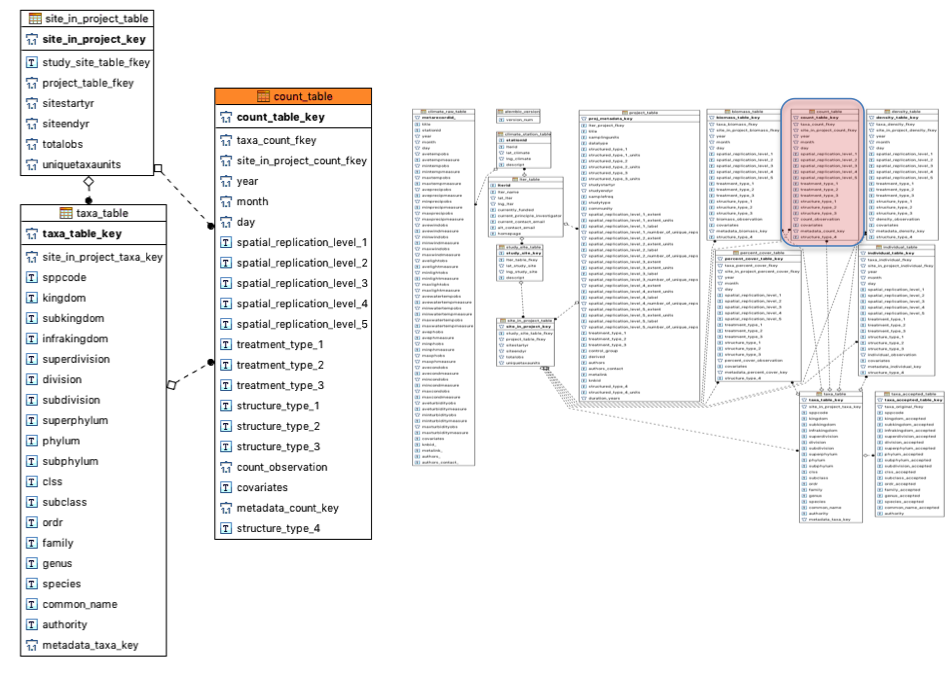
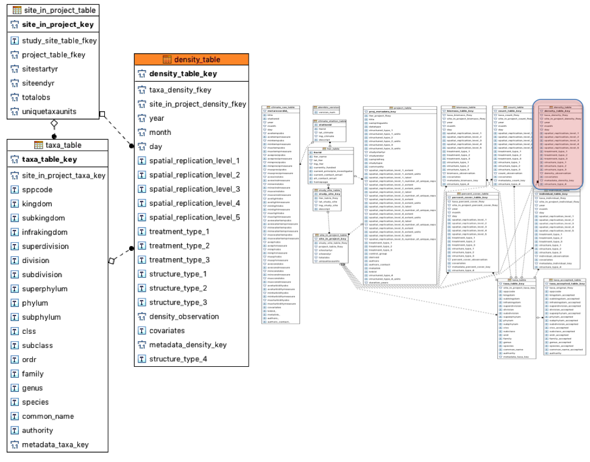
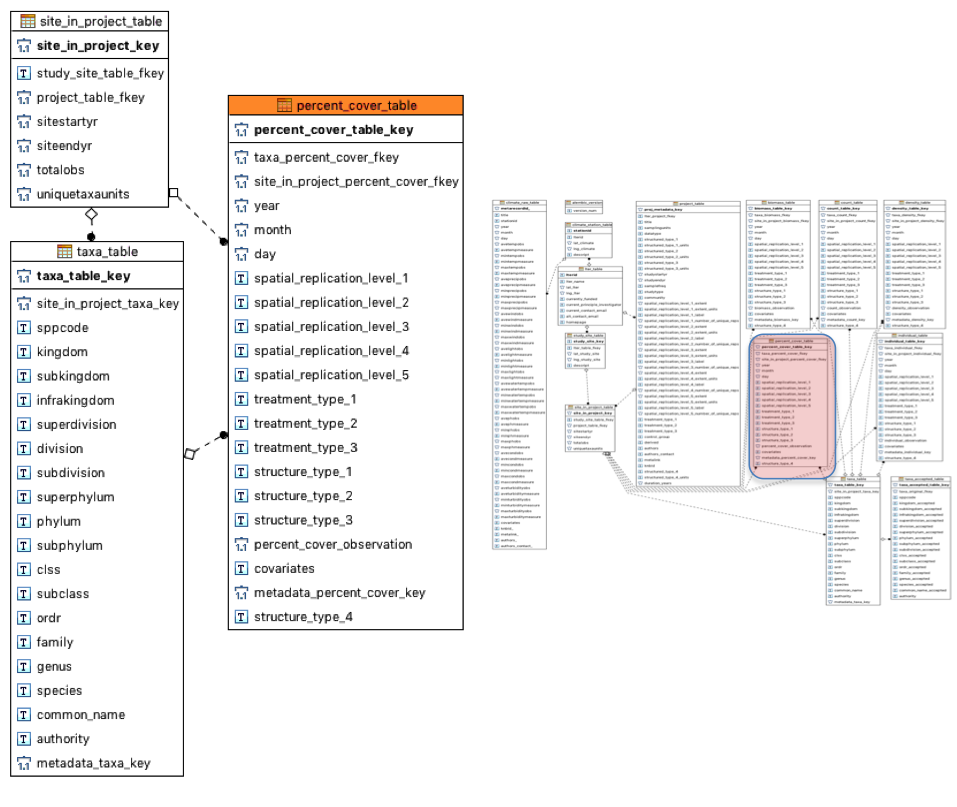
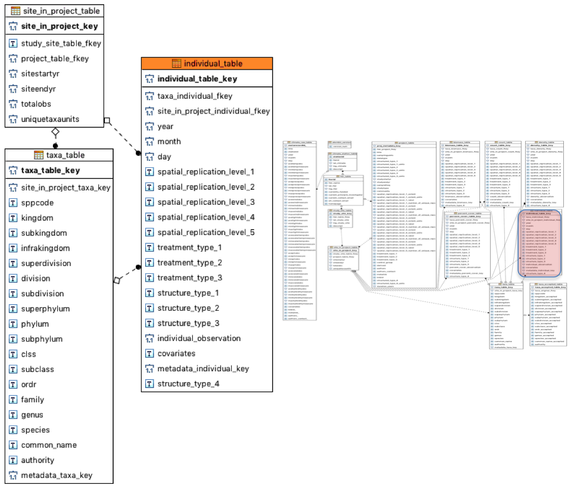

```{r, include=FALSE, message=FALSE}
#### Setting up packages and data #####
##############################################################################
#------- Install any required packages that are not currently installed -----
##############################################################################
adm.req <-c("readxl")

# Load currently installed, required packages
tmp <- lapply(adm.req, require, character.only = T)

# Find the required packages that still need to be installed
adm.need <- adm.req[!(paste0("package:",adm.req) %in% search())]

# Install required packages that are not currently installed
if(length(adm.need)>0){ install.packages(adm.need,dependencies=T) }

# Now, make sure all packages are loaded
tmp <- lapply(adm.req, require, character.only = T)

# print tmp if you want a print out of which packages loaded successfully
tmp

knitr::opts_chunk$set(message=FALSE, warning=FALSE)
```

## Popler Overview
Popler is a database of population and individual-level data gathered throughout the Long Term Ecological Research (LTER) stations funded by the USA National Science Foundation.

We define _population data_ datasets as time series on the size or density of a population of a taxonomic unit. The size of a population can be quantified as a count, biomass, or cover class. These measures are always repeated temporally, and they are often repeated spatially as well.

We define _individual-level_ data as information on the attributes of the individuals, or a subset thereof, that make up a population. For example, common attributes of individuals are size, age, and sex.


### Temporal replication
All temporal information within a dataset is stored using 
sampling dates up to, when available, the daily resolution. Since not all datasets have the same temporal resolution, popler stores date information in three separate columns; **day, month, and year**. In any of the date time columns, `NULL` or `-99999` values indicate that the information was not available from the raw data. 

Note that **never do we perform any temporal aggregations of data prior to storing them in Popler.**

### Spatial replication
`popler` subdivides spatial replicates based on their spatial nestedness, because most sampling designs are spatially nested. For example, a study performed at 5 sites, with 3 transects at each site, and 4 quadrats within each transect, contains 3 levels of nested spatial replication:

- Level 1: the site level, 
- Level 2: the transect level
- Level 3: the quadrat level

This referencing scheme allows us to standardize and align datasets collected from a variety of different sampling designs and across different data types.

Metadata on the extent of each spatial sampling unit is recorded when 
available (i.e. km2, m, cm3, etc.). Note, higher levels of spatial replication 
indicate smaller areas of sampling extent. 

Similarly to temporal replication, **never do we aggregate data by levels of spatial replication prior to storing them in Popler.**

#### Spatial Replication Level 1
The first level of spatial replication is also the highest, or coarsest, level of nested spatial replication. We call this level 1 'site'. LTER stations contain permanent 'sites' which are reused across studies. Therefore, "site" labels allow querying data collected at a particular site regardless of the original study a dataset was derived from.

Whenever available in the source metadata, these 'sites' are associated with latitude and longitude coordinates are also recorded if available; `-99999` values exist within these fields for studies that do not record geographic location for their 'site' label. 


## The Popler Database Schema

The following image depicts the relationship structure among the 14 tables of popler. Below we will discuss this schema, table contents, and give definitions. Three tables will not be discussed, because two are related to climate and one is a table for database migration information.

```{r, out.width = "675px", echo=FALSE}

```

## 1. LTER Table
Data on the LTER research station.

```{r, out.width = "600px", echo=FALSE}

```

```{r, echo=FALSE}
# lter <- read_excel("data/metadata.xlsx", sheet='lter')
lter <- read.csv("data/lter.csv")
knitr::kable(lter, booktabs = TRUE)
```

## 2. Study Site Table

This table contains the labels that identify "sites" (spatial replication level 1) used across research projects. Different datasets can use the same "site" label if data were collected at the same sampling location.

```{r, out.width = "600px", echo=FALSE}

```

```{r, echo=FALSE}
# lter <- read_excel("data/metadata.xlsx", sheet='study_site')
lter <- read.csv("data/study_site.csv")
knitr::kable(lter, booktabs = TRUE)
```


## 3. Project Table
Metadata related to each separate dataset.

```{r, out.width = "600px", echo=FALSE}

```

```{r, echo=FALSE}
# lter <- read_excel("data/metadata.xlsx", sheet='project')
lter <- read.csv("data/project.csv")
knitr::kable(lter, booktabs = TRUE)
```


## 4. Sites Within Project Table
Site level information regarding starting and ending year of sampling, number of observations, and number of taxonomic units. Note that here, `uniquetaxaunits` refers to the taxonomic units observed within each site, not within each dataset.

```{r, out.width = "600px", echo=FALSE}
knitr::include_graphics("img/site-in-project-table.png")
```

```{r, echo=FALSE}
# lter <- read_excel("data/metadata.xlsx", sheet='site_in_project')
lter <- read.csv("data/site_in_project.csv")
knitr::kable(lter, booktabs = TRUE)
```

## 5. Taxonomic Table
Taxonomic information recorded within a project. In this table, taxonomic information refers to each individual site (spatial replication level 1). 

```{r, out.width = "600px", echo=FALSE}

```

```{r, echo=FALSE}
# lter <- read_excel("data/metadata.xlsx", sheet='taxa')
lter <- read.csv("data/taxa.csv")
knitr::kable(lter, booktabs = TRUE)
```

## 6. Accepted Taxonomic Table
Table containing "accepted" taxonomic information: this is an attempt to associate taxonomic units in the raw data of popler to taxonomic units accepted in the literature. This taxonomic information also refers to individual sites (spatial replication level 1).

```{r, out.width = "600px", echo=FALSE}

```

```{r, echo=FALSE}
# lter <- read_excel("data/metadata.xlsx", sheet='accepted_taxa')
lter <- read.csv("data/accepted_taxa.csv")
knitr::kable(lter, booktabs = TRUE)
```

## 7. Count Table
Population data where abundance is quantified as number of individuals. Null values filled in.

```{r, out.width = "600px", echo=FALSE}

```

```{r, echo=FALSE}
# lter <- read_excel("data/metadata.xlsx", sheet='count')
lter <- read.csv("data/count.csv")
knitr::kable(lter, booktabs = TRUE)
```

## 8. Biomass Table
Population data where abundance is quantified in terms of biomass.


```{r, out.width = "600px", echo=FALSE}
knitr::include_graphics("img/biomass-table.png")
```

```{r, echo=FALSE}
# lter <- read_excel("data/metadata.xlsx", sheet='biomass')
lter <- read.csv("data/biomass.csv")
knitr::kable(lter, booktabs = TRUE)
```

## 9. Density Table
Population data where abundance is quantified in terms of density.


```{r, out.width = "600px", echo=FALSE}

```

```{r, echo=FALSE}
# lter <- read_excel("data/metadata.xlsx", sheet='density')
lter <- read.csv("data/density.csv")
knitr::kable(lter, booktabs = TRUE)
```

## 10. Percent Cover Table
Population data where abundance is quantified in terms of cover.


```{r, out.width = "600px", echo=FALSE}

```

```{r, echo=FALSE}
# lter <- read_excel("data/metadata.xlsx", sheet='percent_cover')
lter <- read.csv("data/percent_cover.csv")
knitr::kable(lter, booktabs = TRUE)
```

## 11. Individual Table
Individual-level data. The `structure_type` columns refer to the attributes of individuals (e.g. size, age, sex, etc.)


```{r, out.width = "600px", echo=FALSE}

```

```{r, echo=FALSE}
# lter <- read_excel("data/metadata.xlsx", sheet='individual')
lter <- read.csv("data/individual.csv")
knitr::kable(lter, booktabs = TRUE)
```
